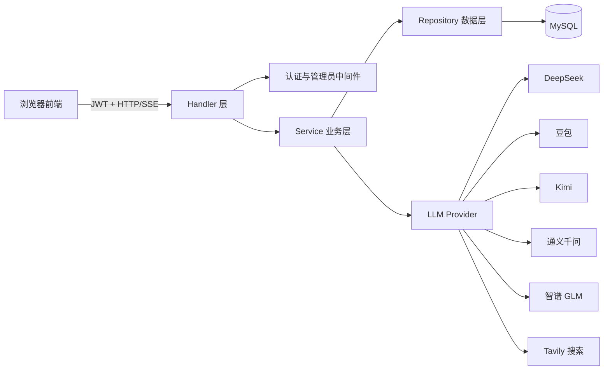

# YoooFind

一个基于 Go、MySQL 和原生 JavaScript 构建的多模型 AI 对话平台。

YoooFind 在开源 Gemini Clone 界面的基础上进行了全栈化改造：将模型密钥和业务逻辑迁移到 Go 后端，统一接入多家 OpenAI 兼容模型，并提供多模型并行回答、SSE 流式输出、联网深度搜索、云端会话、用户系统和管理后台。

> 当前实现不再直接调用 Google Gemini API。旧版“纯前端 + Gemini API + localStorage 会话”架构已经废弃，本文档以当前源码为准。

## 功能特性

### AI 对话

- 支持 DeepSeek、豆包、Kimi、通义千问和智谱 GLM
- 单次最多选择 4 个模型并行回答
- 通过 SSE 实时展示正文和推理内容
- 支持 Markdown、代码块和语法高亮
- 自动携带当前会话最近 5 轮上下文
- 聊天记录持久化到 MySQL
- 每位用户最多保留最近 30 个会话
- 支持文本附件内容拼接和浏览器语音输入

### 联网深度搜索

- 使用 Tavily 获取实时网页搜索结果
- 通过 LLM Function Calling 自主决定是否搜索
- 最多执行 4 轮工具调用
- 检测重复查询，避免模型陷入搜索循环
- 长时间处理时持续推送进度心跳
- 搜索不可用时降级为普通模型回答

### 用户与运营

- 邮箱注册、登录及 JWT 身份认证
- bcrypt 密码哈希
- 用户资料编辑和头像上传
- 用户级每日 Token 配额
- 模型 Token 用量统计
- 页面访问记录和用户反馈
- 管理后台用户、访问量、Token 和反馈管理

## 技术栈

### 前端

- HTML5、CSS3、原生 JavaScript ES Module
- Marked：Markdown 解析
- Shiki / Highlight.js：代码语法高亮
- Chart.js：管理后台图表
- Web Speech API：语音输入
- http-server：本地静态服务

### 后端

- Go 1.23
- `net/http`：HTTP 服务与 SSE
- MySQL 及 `database/sql`
- `go-sql-driver/mysql` v1.8.1
- `golang-jwt/jwt/v5` v5.2.2
- `golang.org/x/crypto/bcrypt`
- Tavily Search API

## 系统架构



后端采用 `Handler → Service → Repository / Provider` 分层：

- Handler：解析 HTTP 请求并组织 JSON 或 SSE 响应
- Service：处理鉴权、配额、会话、上下文和多模型编排
- Repository：封装 MySQL 数据访问
- Provider：统一适配 OpenAI 风格的模型接口
- Middleware：校验 JWT 和管理员权限

## 对话请求链路

```text
浏览器发送问题
  → JWT 中间件校验用户
  → ChatHandler 解析模型、会话和深度搜索参数
  → ChatService 校验每日 Token 配额
  → 创建或读取聊天会话
  → 从 MySQL 读取最近 5 轮上下文
  → Goroutine 并发调用所选模型
  → Provider 解析上游流式响应
  → ChatHandler 通过 SSE 推送到浏览器
  → 保存用户消息、模型回复和 Token 用量
```

SSE 使用以下事件：

- `session`：返回新建或当前会话信息
- `delta`：返回指定模型的增量正文和推理内容
- `model_error`：单个模型调用失败，其他模型继续运行
- `done`：本次回答完成并返回汇总结果
- `error`：请求整体失败

## 项目结构

```text
Gemini-Clone/
├── frontend/
│   ├── index.html                 # 用户端页面
│   ├── script.js                  # 认证、会话、聊天和流式渲染
│   ├── style.css                  # 用户端样式
│   ├── config.js                  # 后端 API 地址
│   ├── admin.html                 # 管理后台页面
│   ├── admin.js                   # 管理后台逻辑
│   ├── admin.css                  # 管理后台样式
│   ├── thinking-radial-glow.js    # 模型思考动效
│   ├── src/
│   │   └── model-catalog.js       # 前端模型目录与选择规则
│   └── assets/                    # 图片、图标和第三方前端资源
├── backend/
│   ├── cmd/server/main.go         # 后端入口与依赖组装
│   ├── internal/
│   │   ├── api/                   # 路由与 HTTP Handler
│   │   ├── auth/                  # JWT 与 bcrypt
│   │   ├── config/                # 环境变量配置
│   │   ├── database/              # MySQL 连接与迁移
│   │   ├── middleware/            # 用户和管理员鉴权
│   │   ├── model/                 # 请求、响应和领域模型
│   │   ├── provider/              # OpenAI 兼容 LLM 客户端
│   │   ├── repository/            # 数据访问层
│   │   ├── service/               # 业务逻辑层
│   │   └── websearch/             # Tavily 搜索客户端
│   ├── migrations/
│   │   ├── 001_init.sql           # 用户、会话、消息、用量和访问表
│   │   └── 002_feedback.sql       # 反馈表
│   └── go.mod
├── package.json                   # 前端本地服务脚本
├── LICENSE.txt
└── README.md
```

## 快速开始

### 1. 环境要求

- Go 1.23 或更高版本
- Node.js 16 或更高版本
- MySQL 8.x
- 至少一个受支持模型的 API Key
- Tavily API Key（可选，仅深度搜索需要）

### 2. 获取项目

```bash
git clone <your-repository-url>
cd Gemini-Clone
npm install
```

### 3. 创建数据库

先启动 MySQL，然后创建数据库：

```sql
CREATE DATABASE yooofind
  CHARACTER SET utf8mb4
  COLLATE utf8mb4_unicode_ci;
```

后端启动时会自动执行 `backend/migrations/001_init.sql` 和 `002_feedback.sql`。

### 4. 配置后端

在 `backend` 目录创建 `.env`：

```dotenv
# HTTP
SERVER_PORT=8080
ALLOWED_ORIGIN=http://localhost:3000

# MySQL
MYSQL_DSN=root:your_password@tcp(127.0.0.1:3306)/yooofind?charset=utf8mb4&parseTime=true&loc=Local

# Authentication
JWT_SECRET=replace_with_a_long_random_secret
JWT_EXPIRY_HOURS=168
ADMIN_EMAIL=admin@example.com

# LLM defaults
UPSTREAM_MAX_TOKENS=2048
UPSTREAM_TEMPERATURE=0.7
UPSTREAM_REQUEST_TIMEOUT_SECONDS=120

# Configure at least one model
DEEPSEEK_API_KEY=
DEEPSEEK_MODEL=deepseek-chat

DOUBAO_API_KEY=
DOUBAO_MODEL=

KIMI_API_KEY=
KIMI_MODEL=moonshot-v1-8k

QWEN_API_KEY=
QWEN_MODEL=qwen-plus

GLM_API_KEY=
GLM_MODEL=glm-4-flash

# Optional deep search
WEB_SEARCH_PROVIDER=tavily
TAVILY_API_KEY=
TAVILY_BASE_URL=https://api.tavily.com
WEB_SEARCH_MAX_RESULTS=5

# Avatar upload
AVATAR_UPLOAD_DIR=./uploads/avatars
AVATAR_MAX_BYTES=3145728
```

只有配置了对应 `*_API_KEY` 的模型才会在后端启用。豆包通常还需要将 `DOUBAO_MODEL` 设置为火山引擎推理接入点 ID。

不要提交 `.env`，也不要把模型 API Key 写入 `frontend/config.js`。

### 5. 启动后端

迁移文件使用相对路径，因此需要在 `backend` 目录启动：

```bash
cd backend
go run ./cmd/server
```

默认地址：

- API：`http://localhost:8080`
- 健康检查：`http://localhost:8080/api/health`

### 6. 启动前端

打开另一个终端，在项目根目录执行：

```bash
npm start
```

浏览器访问：

```text
http://localhost:3000
```

前端 API 地址集中配置在 `frontend/config.js`。部署到其他域名时，需要同步修改该文件以及后端的 `ALLOWED_ORIGIN`。

## API 概览

### 公开接口

- `GET /api/health`：健康检查
- `POST /api/auth/register`：注册
- `POST /api/auth/login`：登录
- `POST /api/visit`：访问记录
- `POST /api/feedback`：提交反馈，可选登录态

### 用户接口

以下接口需要 `Authorization: Bearer <token>`：

- `GET /api/me`：获取用户资料
- `PATCH /api/me`：更新用户资料
- `POST /api/me/avatar`：上传头像
- `GET /api/usage`：查询 Token 用量
- `POST /api/chat`：发送聊天请求
- `GET /api/chat/sessions`：获取会话列表
- `GET /api/chat/sessions/{id}`：获取会话详情
- `DELETE /api/chat/sessions/{id}`：删除会话

### 管理员接口

管理员身份由 `ADMIN_EMAIL` 配置并在服务端二次校验：

- `GET /api/admin/users`
- `/api/admin/users/{id}`
- `GET /api/admin/stats/visits`
- `GET /api/admin/stats/tokens`
- `GET /api/admin/feedback`
- `/api/admin/feedback/{id}`

## 数据持久化

系统使用以下 MySQL 数据表：

- `users`：账号、资料、头像路径和每日 Token 上限
- `token_usage`：每次模型调用的 Token 用量
- `chat_sessions`：聊天会话
- `chat_messages`：用户消息、模型回答和推理内容
- `visit_logs`：按日期和访客标识去重的访问记录
- `feedback`：用户反馈和处理状态

多模型回答使用 `multi_model_reply_v1` JSON 结构写入消息内容，加载历史时会还原各模型回答和当前选中模型。

## 安全设计

- 模型 API Key 仅由后端环境变量读取
- 密码使用 bcrypt 哈希后保存
- 受保护接口统一校验 JWT
- 会话查询和删除同时校验用户 ID，避免越权访问
- 管理接口额外查询数据库并校验管理员邮箱
- CORS 使用明确的 Origin 白名单
- 头像上传限制为图片类型且默认不超过 3 MB

当前版本仍是学习和演示性质的全栈 MVP。公开部署前建议补充：

- API 请求频率限制
- 更严格的头像文件内容校验
- HttpOnly Cookie 或更完善的 Token 存储方案
- 数据库连接池参数和可观测性
- 正式的版本化数据库迁移工具

## 开发与验证

后端可使用以下命令检查所有包是否能够编译：

```bash
cd backend
go test ./...
```

当前仓库尚未提供项目级单元测试和前端自动化测试。建议优先补充：

- `ChatService` 多模型并发及部分失败测试
- Provider 流式响应和推理内容解析测试
- 深度搜索工具循环及防重复测试
- JWT、用户越权和管理员权限测试
- SSE 端到端集成测试

## 常见问题

### 后端提示 `at least one provider API key is required`

至少配置一个受支持模型的 `*_API_KEY`，然后重新启动后端。

### 后端提示 `MYSQL_DSN is required`

确认 `backend/.env` 中已配置 `MYSQL_DSN`，并且从 `backend` 目录执行启动命令。

### 浏览器出现跨域错误

确认后端 `ALLOWED_ORIGIN` 与浏览器实际访问的前端 Origin 完全一致。多个 Origin 可以使用逗号分隔。

### 深度搜索不可用

确认配置了：

```dotenv
WEB_SEARCH_PROVIDER=tavily
TAVILY_API_KEY=your_tavily_api_key
```

### 登录后看不到旧版 localStorage 会话

当前版本已将聊天记录迁移到 MySQL，不再读取旧版 `saved-api-chats` 数据。

## 已知限制

- 当前未提供 Docker、Docker Compose 和 CI/CD 配置
- 尚无自动化测试覆盖
- 会话上下文通过文本拼接最近 5 轮实现，不是原生多角色消息数组
- Token 缺失时使用字符数估算，结果仅用于兜底
- 附件主要在浏览器端读取并拼入提示词，不支持服务端文件存储、OCR 或多模态解析
- 管理员权限基于单个配置邮箱，不是完整 RBAC

## 开源来源与许可

本项目基于 [GourangaDasSamrat/Gemini-Clone](https://github.com/GourangaDasSamrat/Gemini-Clone) 的界面进行二次开发，与 Google 或 Gemini 官方无隶属、合作或背书关系。

项目沿用原仓库的 MIT License，详见 [LICENSE.txt](./LICENSE.txt)。
